#  Project 4 - West Nile Virus Prediction

## Group member

Larb|B.B.|PuNt|
|---|---|---|
||

## Introduction

This is project 4 of of the General Assembly Data Science Immersive course, Project West Nile Virus Prediction. The objective of this project is to demostrate the data science process to provide the prediction of category data, if the virus is found or not. 

## Problem statement

West Nile Virus is a deadly virus transmitted by mosquitoes. Once it infects humans, 20% of individuals may develop symptoms, ranging from a persistent fever to severe neurological illnesses that can lead to death. The City of Chicago and the Chicago Department of Public Health (CDPH) have joined forces to control the spread of mosquitoes and, consequently, the spread of the West Nile Virus.

Our team, consisting of amateur data scientists, has entered a competition hosted by the City of Chicago. Our goal is to develop a predictive model for the occurrence of the virus. This model will assist the City of Chicago in planning pesticide spraying operations and conducting cost-benefit analyses to justify their spraying plans. The results will be presented to members of the Centers for Disease Control and Prevention (CDC), including biostatisticians and epidemiologists.

## The Data

4 set of data were given for model development.
1. Train data
2. Test data 
3. Weather data
4. Pesticides sprayed data

The data dictionary for each data are as follow:

Train data
Column| Description|
|---|---|
Id| the id of the record
Date| date that the WNV test is performed
Address| approximate address of the location of trap. This is used to send to the GeoCoder. 
Species| the species of mosquitos
Block| block number of address
Street| street name
Trap| Id of the trap
AddressNumberAndStreet| approximate address returned from GeoCoder
Latitude, Longitude| Latitude and Longitude returned from GeoCoder
AddressAccuracy| accuracy returned from GeoCoder
NumMosquitos| number of mosquitoes caught in this trap
WnvPresent| whether West Nile Virus was present in these mosquitos. 1 means WNV is present, and 0 means not present. 

Test data
Column| Description|
|---|---|
Id| the id of the record
Date| date that the WNV test is performed
Address| approximate address of the location of trap. This is used to send to the GeoCoder. 
Species| the species of mosquitos
Block| block number of address
Street| street name
Trap| Id of the trap
AddressNumberAndStreet| approximate address returned from GeoCoder
Latitude, Longitude| Latitude and Longitude returned from GeoCoder
AddressAccuracy| accuracy returned from GeoCoder

Weather data
Column| Description|
|---|---|
Station| Weather station ID
 Date| Date
 Tmax| Maximum Temperature
 Tmin| Minimum Temperature 
 Tavg| Average Temperature
 Depart| Departure from normal
 DewPoint| dew point temperature
 WetBulb| Wetbulb temperature
 Heat| Heating start in July
 Cool| Colling start in Jan
 Sunrise| time of sunrise
 Sunset| time of sunset
 CodeSum| Code for Tornado/Waterpout
 Depth| Depth of snow (in inch)
 Water1| Depth of water
 SnowFall| T = Trace, M = Missing
 PrecipTotal| Rainfall and melt snow
 StnPressure| Average pressure
 SeaLevel| Sea level pressure
 ResultSpeed| Wind speed (miles per hour)
 ResultDir| resultant direaction
 AvgSpeed| Average wind speed

 Spray data
 Column| Description|
|---|---|
Date| Date of spray
Time| Time of spray
Latitude| Latitude where spray
Longitude| Longitude where spray

## Exploratory Data Analysis and Data pre-processing
##### Check data correction and readiness
- Only feature "time" in spray data contains "null" value. Since there is no time record in other dataset. So, consider drop this feature
- The spray record contain data in year 2011, 2013. But test data has no record in those 2 years. So cosider not using spray data for now.
- Check duplicate data in all dataset, and found duplicated data in Train data. So drop the duplicate from dataset
- Weather data has no "null" value, but vitually, we see blank and missing data. Replace them with "null" before consider dropping them
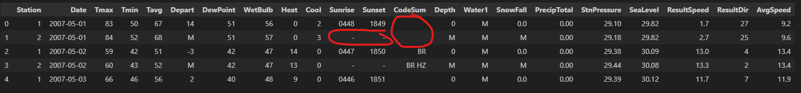
- There are total less than 400 record with replaced null value, out of total 2944 record in weather. This is about 20%, so cosider to drop them.
- convert all data in weather to integer or float
- drop Codesum column, on the assumption that this is tornado warning, this not happen very frequent in Chicago.
- There are 2 station, split them form another set of features. This is to expand the features in order to increase the variance for better prediction when develop the model
- Merge weather with train and test data
- convert and split datetime to year, month, day for both data set
- We are not have 2 data set intead of 4. 1 of 2 is train data and another is test data (to be used for prediction submission)

##### EDA
- Let's check if there is any correlation between data

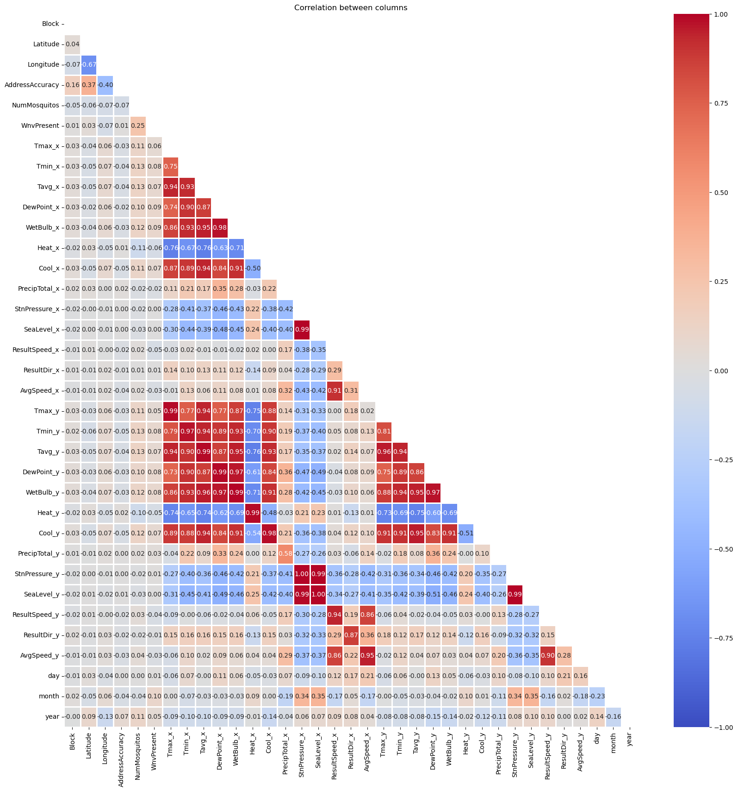
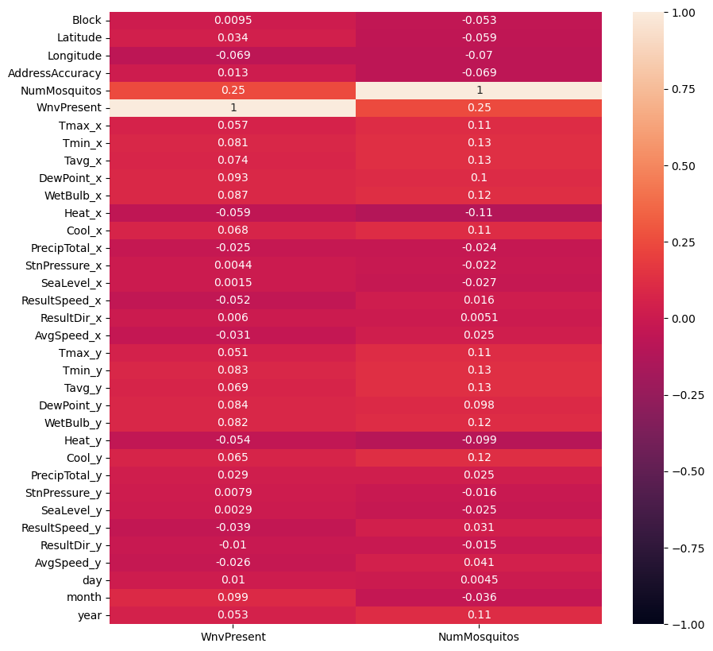

There are no significant correlation between WnvPresent, Nummosquitos and other datas. The correlation only occur amoung weather data. Which is common.

- Check the present of virus across each month of year and each year of record
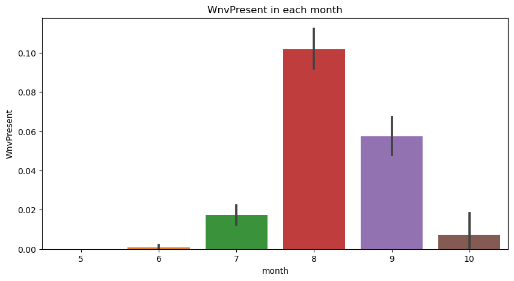
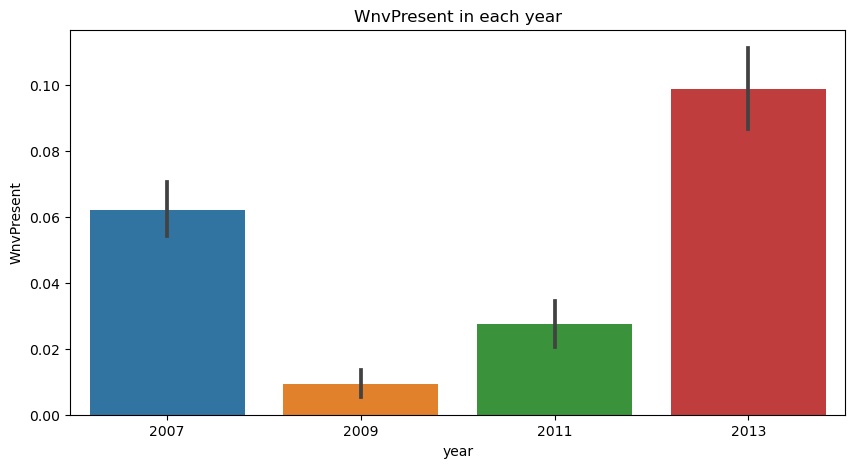

This is clear than the virus is likely to be found during summer. This is likely that it might related to temperature. So let check the present of virus against Temperature
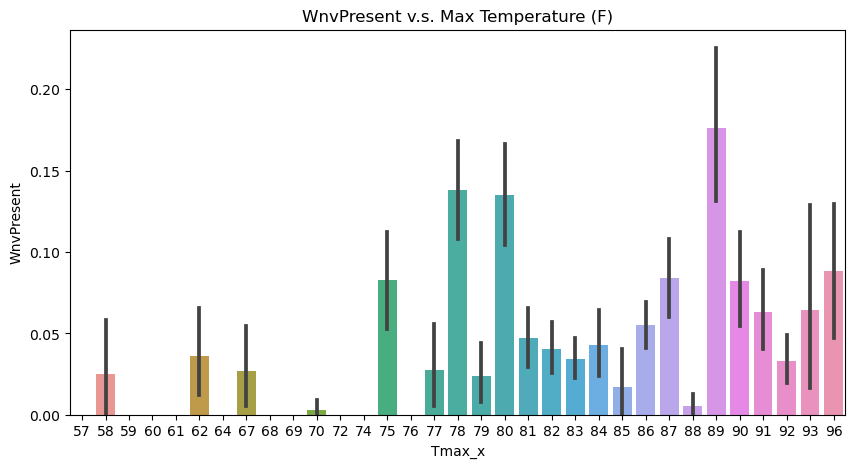

This is align with previous finding. The virus is likely to be found in the higher temperature

- Next, let's check if there is any significant of the location across Chicago
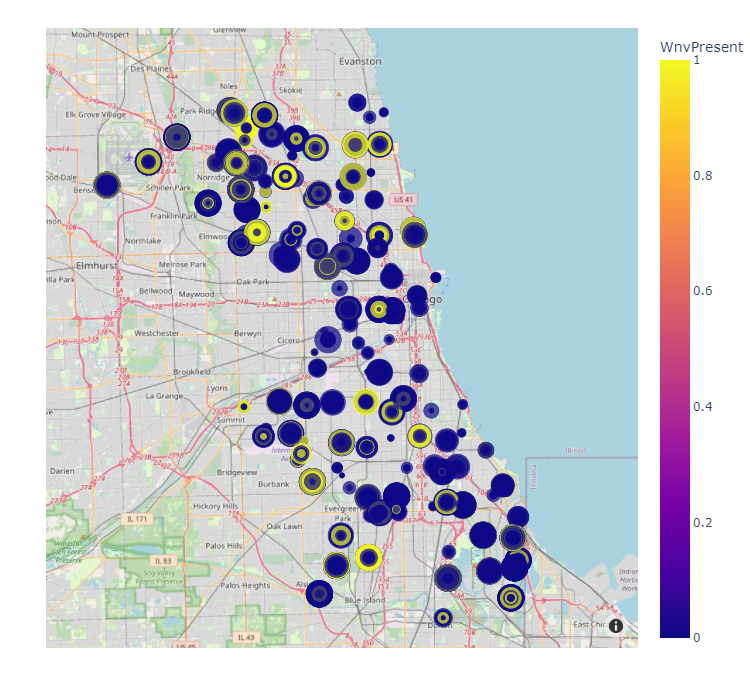

Some area may have more present that other, but it look evenly spread across city.

- Eventhought Spray data doesn't look useful, but let's check them for certian. Check if there is any impact from spray
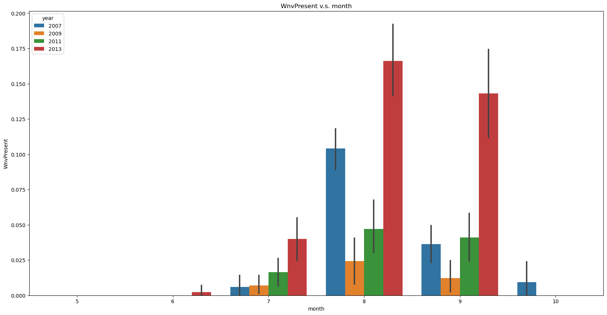

The spray was done in 2011 and 2013. The graph shows that in 2013, the virus present is the highest. The spray not working or did they spray in the wrong place.

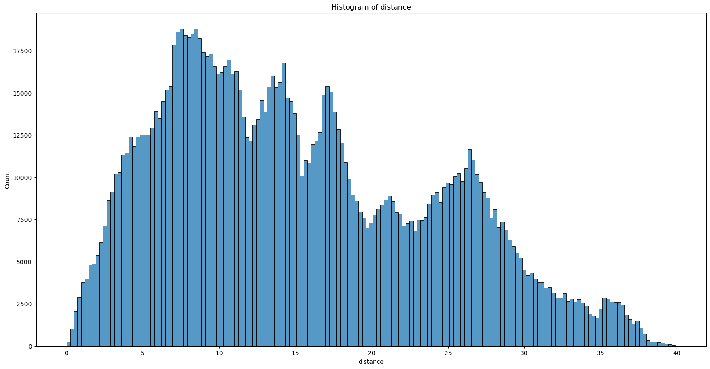

We do the calculation to find the distance (in kilometer) from the spray lat/long to the closest trap. The result in the above graph shows that the spray location is further away range from 1 - 40 km away. So this might be a reason why the spray didn't work.

##### Summary of EDA
- In train data, the baseline score is 5% Present (virus found) and 95% Non-present (virus not found). This is very unbalance train data
- The correlation between most individual features and WnvPresent are quite minimal. 
- The strong predictors are weather related feaatures, so let's select features heavily rely on weather features
- Geolocation such as Trap, Block, Address, Street, lat/long correlation to WnvPresent is unclear.
- The Virus is likely to be found during Jun - Oct. The highest is Aug. 
- The virus is likely to be found in the higher temperature

##### Data preparation for model development
- All location features such as address, street, lat/long, block, trap are all duplicated, so we drop most of them and select only trap
- Features which contain text data such as spicies and traps, so we use label code to convert them to be numerical features.
- In conclustion, we have 36 X variables (features) and 1 Y target variable to work for model development.

## Modeling and result

##### Selecting best model algorithm
This is classification case, predicting the probability of label. So our group start with using 8 classification model to select the best model, and to use the best model for futher tuning
1. Logistic Regression
2. Decision Tree
3. Random Forest
4. AdaBoost
5. Gradient Boosting
6. Bagged Decision Tree
7. SVM
8. XGBoost

Here are result

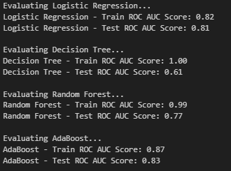   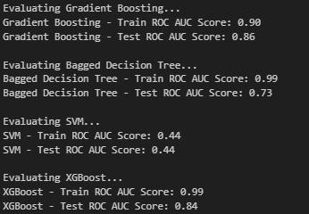

We use AUC-ROC score for evaluating th best model. XGBoost got the best score. So we decide to pick XGBoost for further tuning using gridsearch.

##### Selecting SMOTE vs Non-SMOTE
Since the train data is very unbalance, so we decide to test between
    1) model using original data (Non-SMOTE)
    2) model with resampling data (SMOTE).

The SMOTE one has a better result while train the model. However, after using both models to predict and submit to kaggle, Non-SMOTE gave a better score on Kaggle at 0.7068, while SMOTE model is 0.6778. 

##### Error Analysis to explore futher
To find out what kind of prediction our model has done, we use the splited test data to check the confusion matrix and the tree

 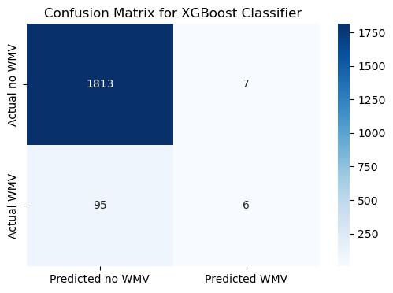

 

Based on confusion matrix, Sensitivity (TP/TP+FN) is low, only 5%. The result indicate that the True Positive over Total actual positive case is very poor. 
 
Based on the decision treem, we see that weather have strong correlation, therefore we decide to do further feature engineering focusing on weather.

 
##### Feature optimization after error analysis
From the error analysis, we found that strong correlation between the temperature and the presence of virus. so we decide to add more features related weathers to improvde the performance. As a result we created 34 more features by creating the bin for each 8 Farenhiet degree of Tmax, Tmin, Tavg, and Wetbulb as features, for example, 'wetbulb_x_bin_bin8'

##### Final model tuning
We apply new features on XG Boost, and the results are improved. AUC-ROC of both splited train and test data of SMOTE went to 0.6 from 0.58. And after submitting to Kaggle, the results also improved as well. Again the non-SMOTE actually got better score than SMOTE

 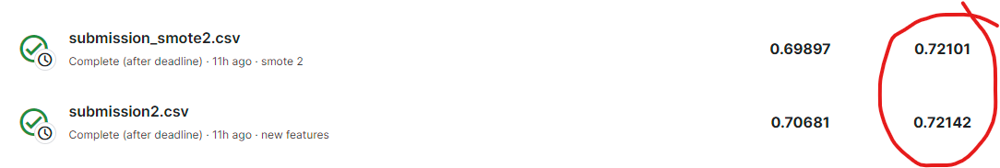

#### Final model limitation
1) the pesticide spraying is not effective because it was done faraway from Trap especially, so the pray data is not usable.
2) the train data is highly imbalance; the imbalance impact the prediction result.
3) the train data is not continuous from year to year; we should have continous yearly data instead.
4) the test data lack WnvPresent data; and the lack of this data make us unable to generate spatial feature such as
       - Distance between trap and WnvPresnt
       - Count of WnvPresent in xx KM during last xx days

## Conclusion & Recommendation

### Predictor
In conclusion, weather, especially temperature, are the strongest predictors for virus presence. 

### Wnv control plan based on our model prediction

The city should encourages practicing the three “R’s” – reduce, repel, and report based on our model prediction.

REPORT: we can use our prediction to check predicted locations where you see water sitting stagnant for more than a week such as roadside ditches, flooded yards, and similar locations that may produce mosquitoes.  

REDUCE: we can use our prediction to make sure that in the predicted areas ...
            - sprays are used preventively 
            - doors and windows have tight-fitting screens, and be repaired or replaced for those that have tears or other openings 
            - doors and windows are shut
            - all sources of standing water where mosquitoes can breed, including water in bird baths, ponds, flowerpots, wading pools, old tires, and any other containers are taken care of

REPEL: we can use our prediction to make sure that in the residents in the predicted areas wear shoes and socks, long pants and a light-colored, long-sleeved shirt, and apply an EPA-registered insect repellent that contains DEET, picaridin, oil of lemon eucalyptus, IR 3535, para-menthane-diol (PMD), or 2-undecanone according to label instructions.  Consult a physician before using repellents on infants.

### Cost and benefit analysis of Wnv control plan based on our model prediction

#### Benefits:

The benefits of using machine learning to control West Nile virus (WNV) control for the government of Chicago, Illinois are numerous and far-reaching. By implementing machine learning, we can be more effectively control WNV, and the city can significantly reduce the risk of WNV transmission, protect the health of its residents, and save money in the long run.

##### 1) Improve the Public Health: 

- Based on statistics in 2022, there were 34 human cases (which are significantly under-reported) and 8 deaths attributed to the disease in the state in 2022, the most in any year since 2018, when there were 17 deaths.
- Using machine learning to predict where and when can reduce the number of WNV cases, and the city can prevent serious illness, hospitalization, and even death. This has a direct impact on the quality of life of Chicago residents and can help to reduce the overall burden on the healthcare system.

##### 2) Reduce the indirect Economic Costs: 

- Using machine learning to predict where and when also can control WNV outbreaks which have a significant economic impact on a city. In addition to the direct costs of medical care, WNV can also lead to lost productivity, decreased tourism, and increased anxiety among residents. By preventing WNV outbreaks, the city can save money and help to keep its economy strong.

#### Cost: 
 The possible cost includes increasing the following activities to ensure that we include the areas by machine learning
    - purchasing and applying larvicide,
    - working with local municipal governments and local news media for WNV prevention and education, 
    - investigating mosquito production sites and nuisance mosquito complaints. 
    - collecting mosquitoes for West Nile virus testing and also collect sick or dead birds for West Nile virus testing.

